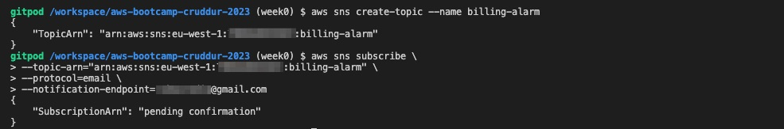
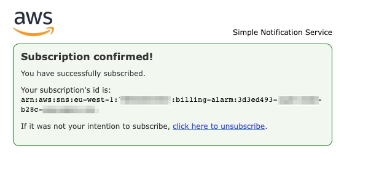
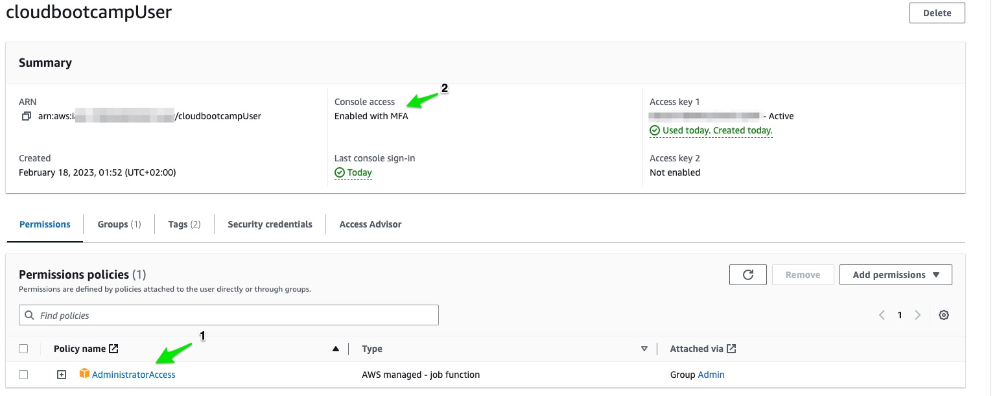
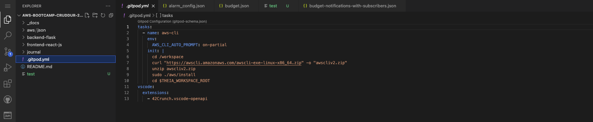
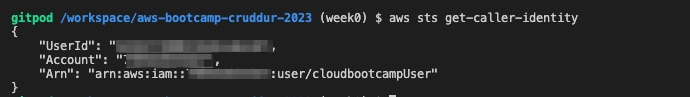

# Week 0 — Billing and Architecture

## Homework:
1. **Billing Alarm**: I utilized my AWS management account to establish a billing Alarm by means of the AWS CLI. 
- To begin, I generated an SNS topic and subsequently arranged a subscription to facilitate a Simple Notification Service (SNS) Topic.

- Email Confirmation

- The metric-alarm was established by establishing a connection between the previously generated topic configuration and the `alarm-config.json` file within the aws directory, which is automatically created upon installation.
- The Configuration syntax:

<details><summary>CLICK ME</summary>

```json
{
    "AlarmName": "DailyEstimatedCharges",
    "AlarmDescription": "This alarm would be triggered if the daily estimated charges exceeds 10$",
    "ActionsEnabled": true,
    "AlarmActions": [
        "arn:aws:sns:us-east-1:548xxxxxxxxx:billing-alarm"
    ],
    "EvaluationPeriods": 1,
    "DatapointsToAlarm": 1,
    "Threshold": 20,
    "ComparisonOperator": "GreaterThanOrEqualToThreshold",
    "TreatMissingData": "breaching",
    "Metrics": [{
        "Id": "m1",
        "MetricStat": {
            "Metric": {
                "Namespace": "AWS/Billing",
                "MetricName": "EstimatedCharges",
                "Dimensions": [{
                    "Name": "Currency",
                    "Value": "USD"
                }]
            },
            "Period": 86400,
            "Stat": "Maximum"
        },
        "ReturnData": false
    },
    {
        "Id": "e1",
        "Expression": "IF(RATE(m1)>0,RATE(m1)*86400,0)",
        "Label": "DailyEstimatedCharges",
        "ReturnData": true
    }]
}
```
</details>

2. **Budget**: I leveraged the AWS CLI and Gitpod to create the following: To begin with, I populated the configuration details into a fresh file named `budjet.json`, which was generated upon installation and can be found within the aws folder.
- Configurstion Syntax:
<details><summary>CLICK ME</summary>

```json
{
    "BudgetLimit": {
        "Amount": "10",
        "Unit": "USD"
    },
    "BudgetName": "Go Away Sapa",
    "BudgetType": "COST",
    "CostFilters": {
        "TagKeyValue": [
            "user:Key$value1",
            "user:Key$value2"
        ]
    },
    "CostTypes": {
        "IncludeCredit": true,
        "IncludeDiscount": true,
        "IncludeOtherSubscription": true,
        "IncludeRecurring": true,
        "IncludeRefund": true,
        "IncludeSubscription": true,
        "IncludeSupport": true,
        "IncludeTax": true,
        "IncludeUpfront": true,
        "UseBlended": false
    },
    "TimePeriod": {
        "Start": 1477958399,
        "End": 3706473600
    },
    "TimeUnit": "MONTHLY"
}
```
</details>

- Created a new file in same directoy called `notifications-with-subscribers.
-Configuration syntax

<details><summary>CLICK ME</summary>

```json
[
    {
        "Notification": {
            "ComparisonOperator": "GREATER_THAN",
            "NotificationType": "ACTUAL",
            "Threshold": 60,
            "ThresholdType": "PERCENTAGE"
        },
        "Subscribers": [
            {
                "Address": "xxxxxxxxgmail.com",
                "SubscriptionType": "EMAIL"
            }
        ]
    }
]
```

</details>

- Put in credentials and run
```shell
aws budgets create-budget \
    --account-id AccountID \
    --budget file://aws/budget.json \
    --notifications-with-subscribers file://aws/budget-notifications-with-subscribers.json
``` 
3. **IAM Admin User**: Through my AWS management account, I have created an IAM admin user and granted them administrative privileges by assigning an admin access policy. Additionally, I have generated an AWS Access key and attached it to the user's account.

4. **MFA**: I implemented Multi-Factor Authentication (MFA) to ensure secure access to the cloudbootcampUser account console. Please refer to the above figure for visual representation.
5. **AWS CLI**: Through the Gitpod platform, I synchronized the cruddur repository on Github with a web-based VScode editor. Following this, I installed and configured the AWS CLI to further enhance the development environment. In order to enable partial autoprompt mode in debugging, I incorporated the gitpod task below into my `.gitpod.yml` file.

- The Installation commands for linux OS:
	```shell
	curl "https://awscli.amazonaws.com/awscli-exe-linux-x86_64.zip" -o "awscliv2.zip"
	unzip awscliv2.zip
	sudo ./aws/install
	```
- The Configuration commands:
	```shell
	gp env AWS_ACCESS_KEY_ID="xxxxxxxxx"
	gp env AWS_SECRET_ACCESS_KEY="xxxxxxx"
	gp env AWS_DEFAULT_REGION=us-east-1
	```
- To verify the configuration I ran this command `aws sts get-caller-identity`


6. **Conceptual Diagram**: Refer to the lucid chart for the concetual diagram of the cruddur application. [here](https://lucid.app/lucidchart/5da453a1-0225-4b35-9316-a5df4b2fadeb/edit?viewport_loc=-71%2C-63%2C2219%2C1075%2C0_0&invitationId=inv_3649bcf1-2688-4612-a05d-d55cfadd7bcc)
Diagram Flow:
- The WEB Layer facilitates access for users of the cruddur application through the internet, enabling them to make requests. These requests are authenticated via a decentralized system and subsequently passed to the load balancer for routing to either the front end or the back end in the APP layer, depending on the nature of the request.
- The APP layer consists of the Front end (which serves the website) and Back end (comprising the server that works with user-generated data), and communication between the two is facilitated by APIs. A search service is provided to allow users to search for data, which is attached to the backend server. Caching is employed to optimize real-time user experience.
- The DATABASE layer stores stateful data for ephemeral cruds and user identities. The messaging system curates the feed to user preferences, utilizing data obtained from the database.
- Security measures implemented to ensure the entire application is secured include the use of secure coding practices, regular security audits, and the utilization of intrusion detection and prevention systems.
- The end result is a fully functional, highly profitable application that generates substantial Return on Investment (ROI).
7. **Logical/Architecture Diagram**: Refer to the lucid chart for the Logical/Architecture diagram of the cruddur application. [here](https://lucid.app/lucidchart/11228acb-2a8a-4b7f-9f45-94fd9e647c27/edit?invitationId=inv_ece82853-b582-4848-be15-fedca2a29161)
- The Architecture Diagram, commonly referred to as the Logical Diagram, is a comprehensive graphical representation that showcases the various components of a distributed system, and it effectively communicates the system's workflow to the engineers tasked with constructing it.