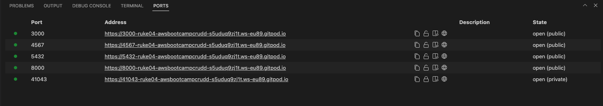
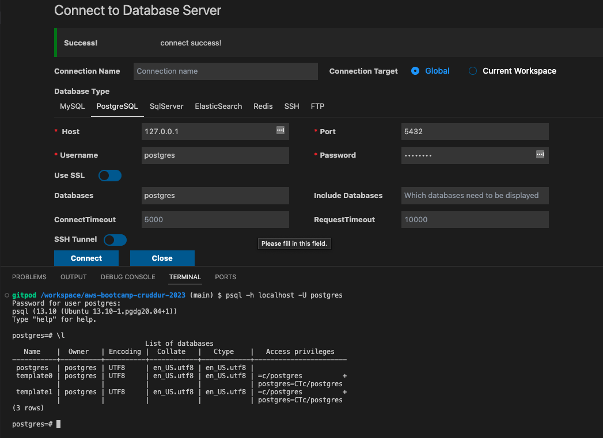
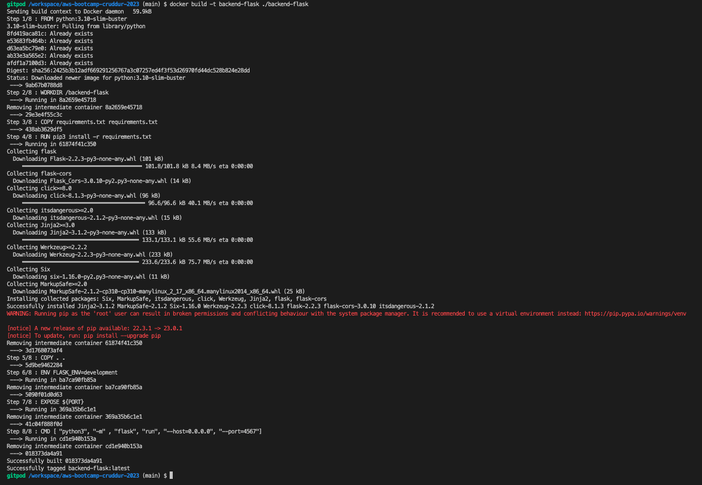
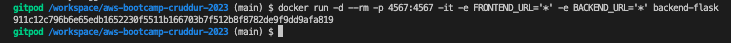
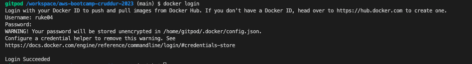
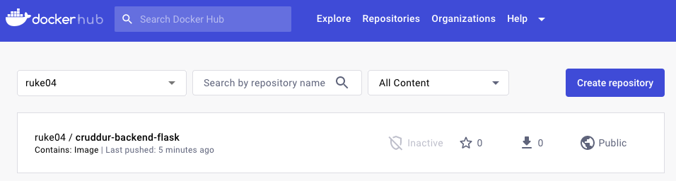
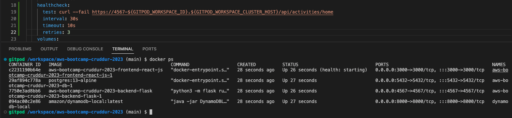
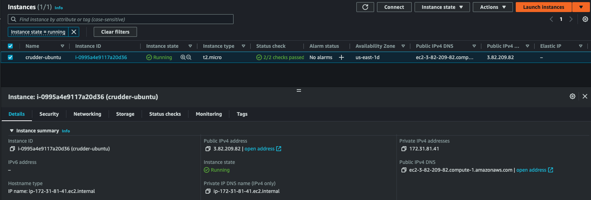
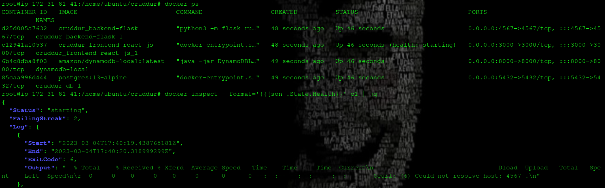

# Week 1 — App Containerization

## Homework Challenges
- Run the Dockerfile CMD as an external script
- Push and tag a image to DockerHub
- Use multi-stage building for a Dockerfile build
- Implement a healthcheck in the V3 Docker compose file
- Research best practices of Dockerfiles and attempt to implement it in your Dockerfile]
- Learn how to install Docker on your localmachine and get the same containers running outside of Gitpod / Codespaces]
- Launch an EC2 instance that has docker installed, and pull a container to demonstrate you can run your own docker processes
## Containerize the Frontend

In the frontend-react-js directory create a dockerfile and populate the Dockerfile created with the following commands
```dockerfile
FROM node:16.18

ENV PORT=3000

COPY . /frontend-react-js

WORKDIR /frontend-react-js

RUN rm -rf node_modules \
    && npm install

EXPOSE ${PORT}

CMD ["npm", "start"]
```

## Containerize the Backend

In the backend-flask directory create a dockerfile and populate the Dockerfile created with the following commands
```dockerfile
FROM python:3.10-slim-buster

WORKDIR /backend-flask

COPY requirements.txt requirements.txt

RUN pip3 install -r requirements.txt

COPY . .

ENV FLASK_ENV=development \
    PORT=4567

EXPOSE ${PORT}

CMD [ "python3", "-m" , "flask", "run", "--host=0.0.0.0", "--port=4567"]
```

Now that we have the two applications containerized and working as we want, it's time to orchestrate the containers

## Running the Containers

From the root folder create a `docker-compose` file and populate it with the following commands

```yaml
version: "3.8"
services:
  backend-flask:
    environment:
      FRONTEND_URL: "https://3000-${GITPOD_WORKSPACE_ID}.${GITPOD_WORKSPACE_CLUSTER_HOST}"
      BACKEND_URL: "https://4567-${GITPOD_WORKSPACE_ID}.${GITPOD_WORKSPACE_CLUSTER_HOST}"
    build: ./backend-flask
    ports:
      - "4567:4567"
    volumes:
      - ./backend-flask:/backend-flask
  frontend-react-js:
    environment:
      REACT_APP_BACKEND_URL: "https://4567-${GITPOD_WORKSPACE_ID}.${GITPOD_WORKSPACE_CLUSTER_HOST}"
    build: ./frontend-react-js
    ports:
      - "3000:3000"
    volumes:
      - ./frontend-react-js:/frontend-react-js
  dynamodb-local:
      # https://stackoverflow.com/questions/67533058/persist-local-dynamodb-data-in-volumes-lack-permission-unable-to-open-databa
      # We needed to add user:root to get this working.
      user: root
      command: "-jar DynamoDBLocal.jar -sharedDb -dbPath ./data"
      image: "amazon/dynamodb-local:latest"
      container_name: dynamodb-local
      ports:
        - "8000:8000"
      volumes:
        - "./docker/dynamodb:/home/dynamodblocal/data"
      working_dir: /home/dynamodblocal
  db:
      image: postgres:13-alpine
      restart: always
      environment:
        - POSTGRES_USER=postgres
        - POSTGRES_PASSWORD=password
      ports:
        - '5432:5432'
      volumes: 
        - db:/var/lib/postgresql/data
        
# the name flag is a hack to change the default prepend folder
# name when outputting the image names
networks: 
  internal-network:
    driver: bridge
    name: cruddur


volumes:
  db:
    driver: local
```
From terminal run the following commands 

```
cd frontend-react-js                   #change directory to frontend folder
npm i                                  #NPM installs the dependencies
```
Then change directory to the root folder and use the following command to startup the containers

```
docker compose-up
```
Make sure to open the folllowing ports 

Also check that postgres connection is made



## Use multi-stage building for a Dockerfile build

Multistage build is a technique used in Dockerfile to create a smaller and more efficient final image. This is achieved by dividing the build process into multiple stages and only including the necessary files for production in the final stage. This results in a significant reduction in the size of the image, making it more lightweight and easier to distribute.

During the build process, unnecessary files and tools used for building the image are left behind in the intermediate stages, reducing the final image size. The end result is an image that performs the same function as the original, but with a much smaller footprint. This technique is particularly useful for large or complex applications that require a lot of dependencies and resources.

Overall, multistage builds are an effective way to optimize Docker images, making them more efficient and easier to deploy. By reducing the image size, it is possible to save on storage space and speed up deployment times, making it a valuable technique for developers and DevOps professionals.

To show this, edit the ```Dockerfile```in the frontend-react-js folder as follows

```dockerfile
# build image
FROM node:16.17.0-bullseye-slim AS build

WORKDIR /frontend-react-js

COPY --chown=node:node package.json .

ENV NODE_ENV=pilot

RUN npm install --pilot

# pilot image
FROM node:lts-alpine3.17

ENV NODE_ENV pilot

WORKDIR /frontend-react-js

USER node

COPY --from=build /frontend-react-js/node_modules /frontend-react-js/node_modules

COPY --chown=node:node . .

CMD ["npm", "start"]
```
## Run the Dockerfile CMD as an external script

From the root of the directory I built the backend container with the following command

```bash
docker build -t backend-flask ./backend-flask
```

Then I ran the container with specifying the required enviromental variables and port to be opened
```bash
docker run -d --rm -p 4567:4567 -it -e FRONTEND_URL='*' -e BACKEND_URL='*' backend-flask
```

## Push and tag an image to DockerHub
First I logged in to docker hub.

Then I used the following commands to tag and push the image to docker hub.
```bash
docker tag SOURCE_IMAGE[:TAG] TARGET_IMAGE[:TAG]
docker tag backend-flask:latest ruke04/cruddur-backend-flask:1.0
docker push ruke04/cruddur-backend-flask:1.0
```



## Implement a healthcheck in the V3 Docker compose file
Add the following lines to the docker-compose file to implement a health check
```YAML
    healthcheck:
      test: curl --fail https://4567-${GITPOD_WORKSPACE_ID}.${GITPOD_WORKSPACE_CLUSTER_HOST}/api/activities/home
      interval: 30s
      timeout: 10s
      retries: 3
```
This will show the status 


## Launch an EC2 instance that has docker installed, and pull a container to demonstrate you can run your own docker processes
* Create and launch an Ubuntu ec2 instance with key pair to securely connect to the instance

* Login to the instance via ssh from your local machine
```bash
ssh -i ~/Downloads/rukecomskey.pem ubuntu@ec2-3-82-209-82.compute-1.amazonaws.com

```
* Install [docker](https://docs.docker.com/engine/install/ubuntu/) engine and clone the project repo fron github and rename it to cruddur
* Install the neccessary dependencies and run the command from the folder root 
```bash
docker-compose up      # To build and run the images
docker ps              # To show the running containers
```


* Use the following command to check docker image health.

```bash

docker inspect --format='{{json .State.Health}}' 33 | jq
```