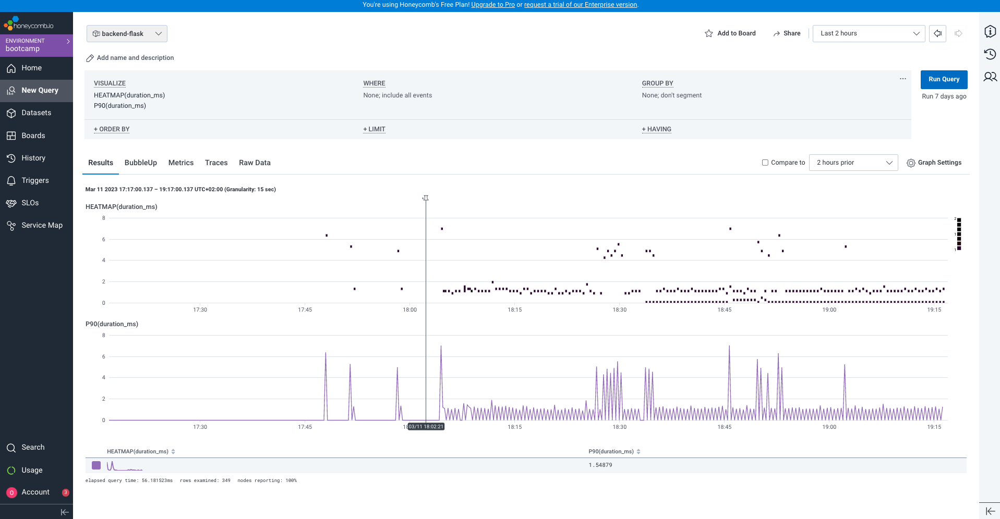
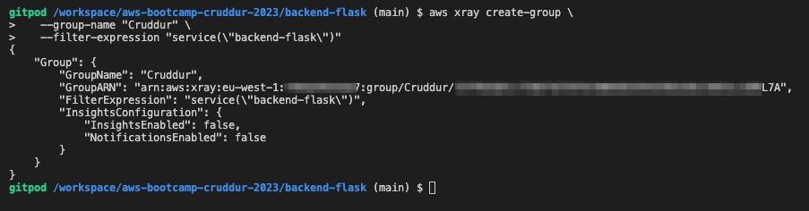
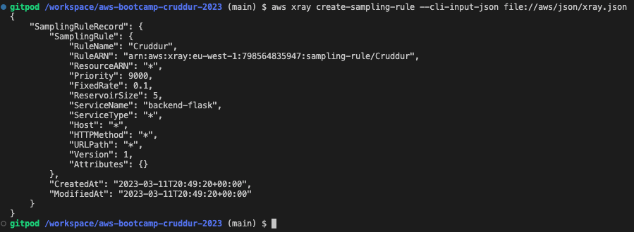
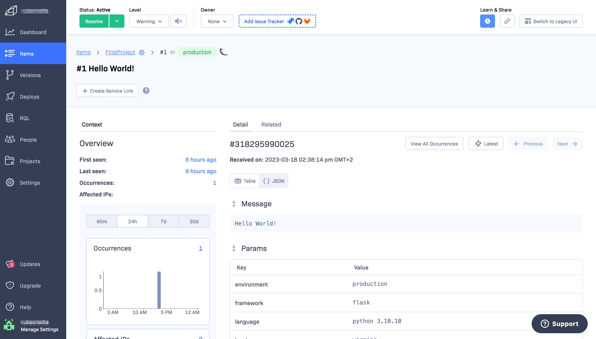

# Week 2 — Distributed Tracing

This guide provides instructions for configuring OpenTelemetry in a Python-based backend service to ensure that instrumentation data is sent to Honeycomb.

Add the following to the requirements.txt file in the backend folder

```bash
opentelemetry-api
opentelemetry-sdk
opentelemetry-exporter-otlp-proto-http
opentelemetry-instrumentation-flask
opentelemetry-instrumentation-requests
```

To send data to Honeycomb, create and initialize a tracer and Flask instrumentation by adding the following lines to your existing Flask app initialization file (app.py or a similar file).

## Initialize tracing with HoneyComb
```bash
from opentelemetry import trace
from opentelemetry.instrumentation.flask import FlaskInstrumentor
from opentelemetry.instrumentation.requests import RequestsInstrumentor
from opentelemetry.exporter.otlp.proto.http.trace_exporter import OTLPSpanExporter
from opentelemetry.sdk.trace import TracerProvider
from opentelemetry.sdk.trace.export import BatchSpanProcessor
```
## Initialize tracing and an exporter that can send data to Honeycomb
```bash
provider = TracerProvider()
processor = BatchSpanProcessor(OTLPSpanExporter())
provider.add_span_processor(processor)
trace.set_tracer_provider(provider)
tracer = trace.get_tracer(__name__)
```
# Initialize automatic instrumentation with Flask
```bash
app = Flask(__name__)
FlaskInstrumentor().instrument_app(app)
RequestsInstrumentor().instrument()
```

To send events to Honeycomb using environment variables, set up OpenTelemetry configuration with the x-honeycomb-team header as your API key. Additionally, specify the service name using OTEL_SERVICE_NAME, which will be used as the Service Dataset in Honeycomb to store data.

```bash
export OTEL_EXPORTER_OTLP_ENDPOINT="https://api.honeycomb.io/"
export OTEL_EXPORTER_OTLP_HEADERS="x-honeycomb-team=your-api-key"
export OTEL_SERVICE_NAME="your-service-name"
```
## Troubleshooting API Keys
If you're not receiving any data in Honeycomb, it could be due to the use of incorrect API keys. To determine if data is being sent out of your app, try the following steps.

Edit app.py and add the following lines to it:
```
...
from opentelemetry.sdk.trace.export import SimpleSpanProcessor, ConsoleSpanExporter

...
# Simple Span Processor [show output in the logs withing the backend-flask app (STDOUT)]
simple_processor = SimpleSpanProcessor(ConsoleSpanExporter())
provider.add_span_processor(simple_processor)
```

By visiting honecomb-whoami.glitch.me and pasting your HONEYCOMB_API_KEY, you can obtain information about the API Key.

## Creating a Tracer
In order to generate spans, you will require a Tracer, which can be obtained by adding the following lines of code to the services/home_activities.py file.

```bash
from opentelemetry import trace

tracer = trace.get_tracer("tracer.name.here")
```
OpenTelemetry mandates that you provide a name as a string while creating a Tracer, and this is the only mandatory parameter. Upon sending the traces to Honeycomb, the Tracer name gets converted into the library.name field, which is helpful in viewing all the spans generated by a specific tracer. Additionally, this field is utilized when dealing with traces created from instrumentation libraries.

## Creating Spans
With the tracer configured, it's now possible to create spans that describe the various activities taking place within your application. These spans could include an HTTP handler, a long-running operation, or a database fetch, among others.

```bash
from opentelemetry import trace

tracer = trace.get_tracer(__name__)
with tracer.start_as_current_span("http-handler"):
    with tracer.start_as_current_span("my-cool-function"):
        # do something
```
## Adding Attributes to Spans
Adding context to a currently executing span in a trace is often advantageous. For instance, if you have an application or service that manages users, you may want to link the user with the span while analyzing your data in Honeycomb. To accomplish this, retrieve the current span from the context and assign an attribute with the user ID.

```bash
from opentelemetry import trace

...

tracer = trace.get_tracer(__name__)
with tracer.start_as_current_span("http-handler") as outer_span:
    with tracer.start_as_current_span("my-cool-function") as inner_span:
        outer_span.set_attribute("outer", True)
        inner_span.set_attribute("inner", True)

...

span = trace.get_current_span()
span.set_attribute("user.id", user.id())
````


# Instrument AWS X-Ray

You can use OpenTelemetry Python and the AWS Distro for OpenTelemetry (ADOT) Collector to instrument your application and send trace data to AWS X-Ray, as the OpenTelemetry SDKs are widely accepted as the industry standard for tracing instrumentation. 

The AWS X-Ray SDK for Python can be installed with the command provided below, which installs all non-testing dependencies of the SDK. The SDK is compatible with Python versions 2.7, 3.4, 3.5, and 3.6.

```bash
pip install aws-xray-sdk
```
Add the SDK as a dependency in your requirements.txt file.
```bash
Example requirements.txt
aws-xray-sdk==2.4.2
boto3==1.4.4
botocore==1.5.55
Django==1.11.3
````

## Adding the middleware to your application (flask)
To instrument a Flask application with AWS X-Ray, start by configuring a segment name on the xray_recorder. After that, use the XRayMiddleware function to patch the Flask application in the code.

Add the following lines of code to app.py

```bash
...
from aws_xray_sdk.core import xray_recorder
from aws_xray_sdk.ext.flask.middleware import XRayMiddleware

app = Flask(__name__)

...
xray_url = os.getenv("AWS_XRAY_URL")
xray_recorder.configure(service='cruddur-backend-flask', dynamic_naming=xray_url)
XRayMiddleware(app, xray_recorder)
```

You can configure the X-Ray recorder in your code to apply custom sampling rules or modify other settings, which enables it to trace requests served by your Flask application using the default sampling rate.

## Create an AWS X-Ray group

```yaml
FLASK_ADDRESS="https://4567-${GITPOD_WORKSPACE_ID}.${GITPOD_WORKSPACE_CLUSTER_HOST}"
aws xray create-group \
   --group-name "Cruddur" \
   --filter-expression "service(\"cruddur-backend-flask\") {fault OR error}"
````

## Create a sampling rule

Move into the backend-flask directory and create a xray.json file
```json
{
  "SamplingRule": {
      "RuleName": "cruddur",
      "ResourceARN": "*",
      "Priority": 9000,
      "FixedRate": 0.1,
      "ReservoirSize": 5,
      "ServiceName": "backend-flask",
      "ServiceType": "*",
      "Host": "*",
      "HTTPMethod": "*",
      "URLPath": "*",
      "Version": 1
  }
}
```

To generate a sampling rule, run the command below while you are still in the backend-flask directory.

```bash
aws xray create-sampling-rule --cli-input-json file://backend-flask/xray.json
```
Add the following variables to the backend-flask service docker-compose file

```bash
AWS_XRAY_URL: "*4567-${GITPOD_WORKSPACE_ID}.${GITPOD_WORKSPACE_CLUSTER_HOST}*"
AWS_XRAY_DAEMON_ADDRESS: "xray-daemon:2000"
```

# CloudWatch Logs
Add the following to the requirements.txt file.
```
...
watchtower
```
To send Flask logs to a CloudWatch Logs stream named cruddur, include the following lines of code in app.py.
```py
...
import watchtower, logging
from time import strftime

# Configuring Logger to Use CloudWatch
LOGGER = logging.getLogger(__name__)
LOGGER.setLevel(logging.DEBUG)
console_handler = logging.StreamHandler()
cw_handler = watchtower.CloudWatchLogHandler(log_group='cruddur')
LOGGER.addHandler(console_handler)
LOGGER.addHandler(cw_handler)

@app.after_request
def after_request(response):
    timestamp = strftime('[%Y-%b-%d %H:%M]')
    LOGGER.error('%s %s %s %s %s %s', timestamp, request.remote_addr, request.method, request.scheme, request.full_path, response.status)
    return response
```
We'll log something in an API endpoint
```py
LOGGER.info('IAM Active Logger! from  /api/activities/home')
```
Set the following environment vars in the backend-flask service section of docker-compose.yml
```bash
AWS_DEFAULT_REGION: "${AWS_DEFAULT_REGION}"
AWS_ACCESS_KEY_ID: "${AWS_ACCESS_KEY_ID}"
AWS_SECRET_ACCESS_KEY: "${AWS_SECRET_ACCESS_KEY}"
```

# Rollbar

Before proceeding, ensure that you add the following to the requirements.txt file to install the Flask and blinker dependencies.
```.txt
...
rollbar 
blinker
```
We need to set the rollbar access token
```bash
export ROLLBAR_ACCESS_TOKEN=""
gp env ROLLBAR_ACCESS_TOKEN=""
```
Then add the below code to backend-flask in docker-compose.yml
```yml
ROLLBAR_ACCESS_TOKEN: "${ROLLBAR_ACCESS_TOKEN}"
```
Then add the following lines of code to app.py
```py
import rollbar
import rollbar.contrib.flask
from flask import got_request_exception

rollbar_access_token = os.getenv('ROLLBAR_ACCESS_TOKEN')
@app.before_first_request
def init_rollbar():
    """init rollbar module"""
    rollbar.init(
        # access token
        rollbar_access_token,
        # environment name
        'production',
        # server root directory, makes tracebacks prettier
        root=os.path.dirname(os.path.realpath(__file__)),
        # flask already sets up logging
        allow_logging_basic_config=False)

    # send exceptions from `app` to rollbar, using flask's signal system.
    got_request_exception.connect(rollbar.contrib.flask.report_exception, app)
```
An endpoint dedicated to testing Rollbar will be added to app.py.
```py
@app.route('/rollbar/test')
def rollbar_test():
    rollbar.report_message('Just for test', 'warning')
    return "Just for test"
```
