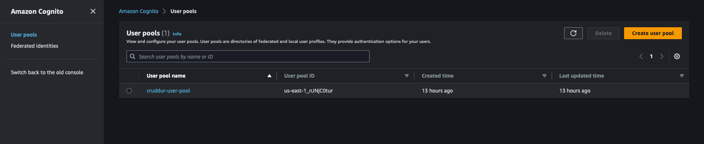
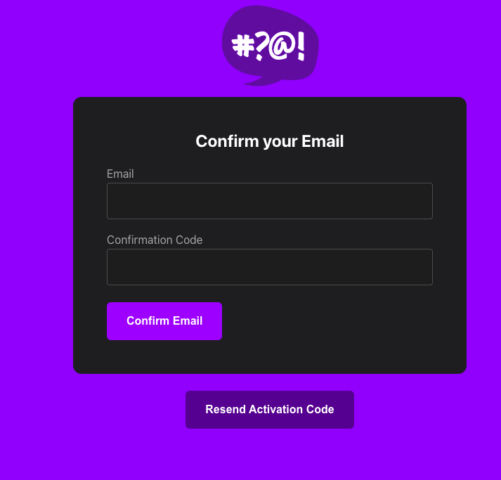
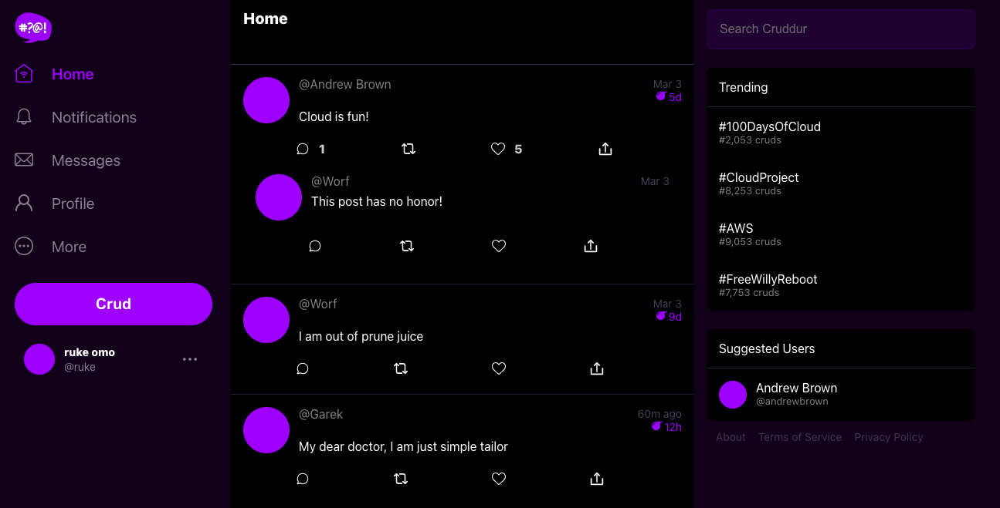

# Week 3 — Decentralized Authentication

## Setup Cognito User Pool

Create the user pool using the AWS console. We named our user pool `cruddur-user-pool`


## Install Amplify
From the terminal use the following command:
```bash
cd front-react-js 
npm i aws-amplyfy --save
````
The following action will make the aws-amplify package a required dependency in the "package.json" file.

Go to the source directory for the frontend and add the specified line of code to the App.js file.
```js
import { Amplify } from 'aws-amplify';

Amplify.configure({
  "AWS_PROJECT_REGION": process.env.REACT_APP_AWS_PROJECT_REGION,
  "aws_cognito_region": process.env.REACT_APP_AWS_COGNITO_REGION,
  "aws_user_pools_id": process.env.REACT_APP_AWS_USER_POOLS_ID,
  "aws_user_pools_web_client_id": process.env.REACT_APP_CLIENT_ID,
  "oauth": {},
  Auth: {
    region: process.env.REACT_AWS_PROJECT_REGION,           // REQUIRED - Amazon Cognito Region
    userPoolId: process.env.REACT_APP_AWS_USER_POOLS_ID,         // OPTIONAL - Amazon Cognito User Pool ID
    userPoolWebClientId: process.env.REACT_APP_AWS_USER_POOLS_WEB_CLIENT_ID,   // OPTIONAL - Amazon Cognito Web Client ID (26-char alphanumeric string)
  }
});
```

Then add the following to the HomeFeedPage.js file 

```js

import { Auth } from 'aws-amplify';

// set a state
const [user, setUser] = React.useState(null);

// check if we are authenicated
const checkAuth = async () => {
  Auth.currentAuthenticatedUser({
    // Optional, By default is false.
    // If set to true, this call will send a 
    // request to Cognito to get the latest user data
    bypassCache: false 
  })
  .then((user) => {
    console.log('user',user);
    return Auth.currentAuthenticatedUser()
  }).then((cognito_user) => {
      setUser({
        display_name: cognito_user.attributes.name,
        handle: cognito_user.attributes.preferred_username
      })
  })
  .catch((err) => console.log(err));
};

// check when the page loads if we are authenicated
React.useEffect(()=>{
  loadData();
  checkAuth();
}, [])
````
Update ProfileInfo.js with the following code:

````js
import { Auth } from 'aws-amplify';

const signOut = async () => {
  try {
      await Auth.signOut({ global: true });
      window.location.href = "/"
  } catch (error) {
      console.log('error signing out: ', error);
  }
}
````


Then update the signin page

````js
import { Auth } from 'aws-amplify';

const onsubmit = async (event) => {
    setErrors('')
    event.preventDefault();
      Auth.signIn(email, password)
        .then(user => {
          localStorage.setItem("access_token", user.signInUserSession.accessToken.jwtToken)
          window.location.href = "/"
        })
        .catch(error => {
          if (error.code == 'UserNotConfirmedException') {
            window.location.href = "/confirm"
          }
          setErrors(error.message)
        });
    return false
}
````
Then we update the following pages to enable us signup and login yo cruddur

## SignUp Page
````js
import { Auth } from 'aws-amplify';

  const onsubmit = async (event) => {
    event.preventDefault();
    setErrors('')
    try {
      const { user } = await Auth.signUp({
        username: email,
        password: password,
        attributes: {
          name: name,
          email: email,
          preferred_username: username,
        },
        autoSignIn: { // optional - enables auto sign in after user is confirmed
          enabled: true,
        }
      });
      console.log(user);
      window.location.href = `/confirm?email=${email}`
    } catch (error) {
      console.log(error);
      setErrors(error.message)
    }
    return false
  }
  ````
## Confirmation Page
````js
import { Auth } from 'aws-amplify';

const resend_code = async (event) => {
    setErrors('')
    try {
      await Auth.resendSignUp(email);
      console.log('code resent successfully');
      setCodeSent(true)
    } catch (err) {
      // does not return a code
      // does cognito always return english
      // for this to be an okay match?
      console.log(err)
      if (err.message == 'Username cannot be empty'){
        setErrors("You need to provide an email in order to send Resend Activiation Code")   
      } else if (err.message == "Username/client id combination not found."){
        setErrors("Email is invalid or cannot be found.")   
      }
    }
  }

  const onsubmit = async (event) => {
    event.preventDefault();
    setErrors('')
    try {
      await Auth.confirmSignUp(email, code);
      window.location.href = "/"
    } catch (error) {
      setErrors(error.message)
    }
    return false
  }
````
## Recovery Page
````js
import { Auth } from 'aws-amplify';

const onsubmit_send_code = async (event) => {
  event.preventDefault();
  setErrors('')
  Auth.forgotPassword(username)
  .then((data) => setFormState('confirm_code') )
  .catch((err) => setErrors(err.message) );
  return false
}

const onsubmit_confirm_code = async (event) => {
  event.preventDefault();
  setErrors('')
  if (password == passwordAgain){
    Auth.forgotPasswordSubmit(username, code, password)
    .then((data) => setFormState('success'))
    .catch((err) => setErrors(err.message) );
  } else {
    setErrors('Passwords do not match')
  }
  return false
}
````
After all these are done, we can signup to cruddur and we get a confirmation code to the email used to signup.


Then we input the confirmation code and email in the confirmation page and click confirm.



This will navigigate to the signin page, the the user can sign in by providing the valid email and password.

